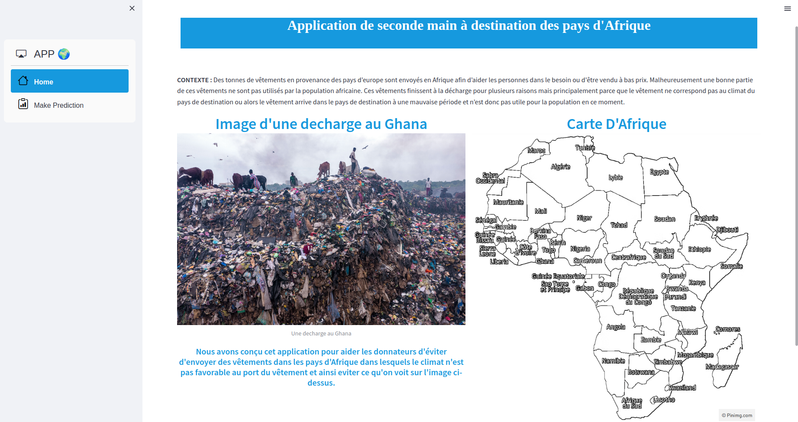
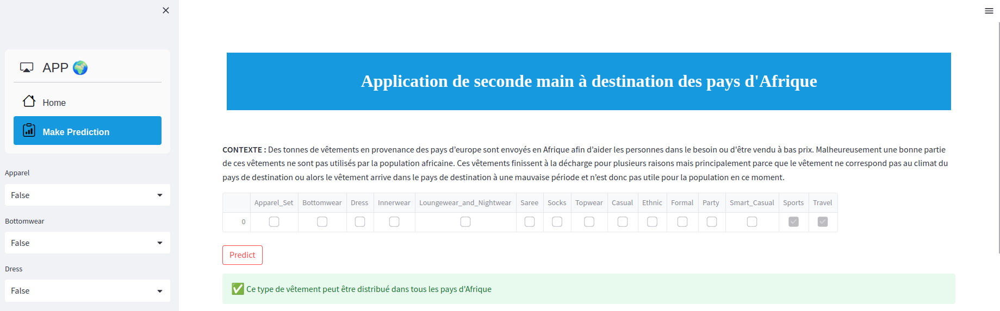
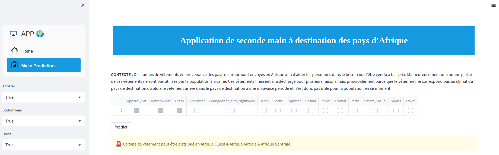

# projet-ia
Application de seconde main à destination des pays d'Afrique

### Data Source : https://www.kaggle.com/datasets/paramaggarwal/fashion-product-images-dataset?resource=download

### Windows command 
pip install virtualenv
#### Create venv
virtualenv venv -p3.10  
#### activate venv             
venv\Scripts\activate     
#### Download framework          
pip install -r requirements.txt

### Lunix command 
sudo pip install virtualenv
#### Create venv
python3 -m venv env
#### activate venv             
source env/bin/activate    
#### requirements          
pip install -r requirements.txt  

### MacOS / Linux command 
#### Create venv
virtualenv venv -p3.10
#### activate venv
source venv/bin/activate
#### Download framework 
pip install -r requirements.txt 

## Run
Executer l'application depuis le terminal
streamlit run app.py

## Lien vers l'application
https://medgoby-projet-ia-app-yu544e.streamlit.app/
## Une vue de l'application

